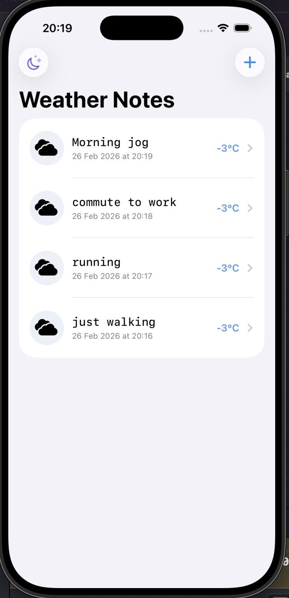
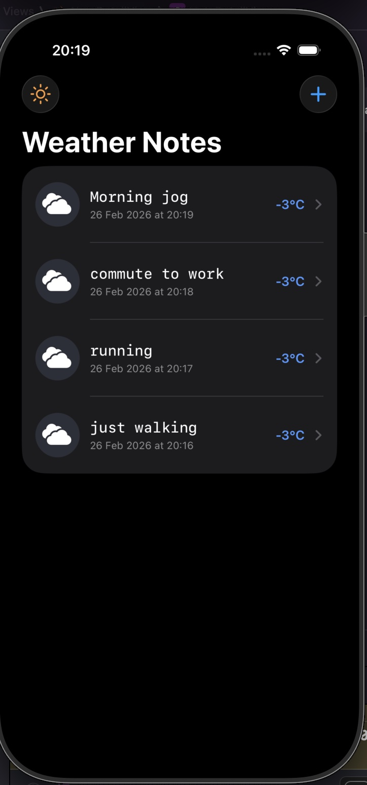
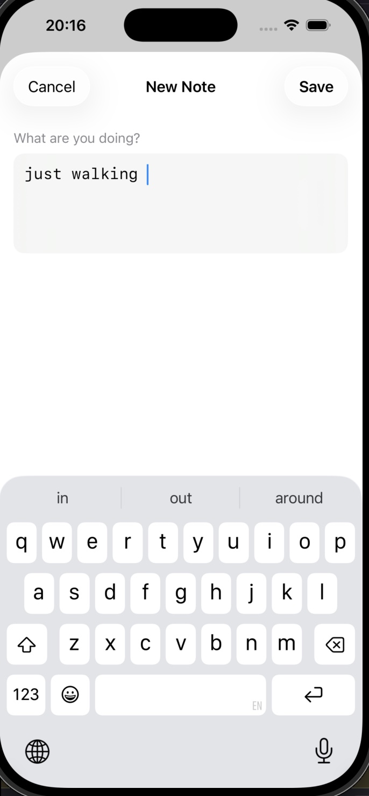
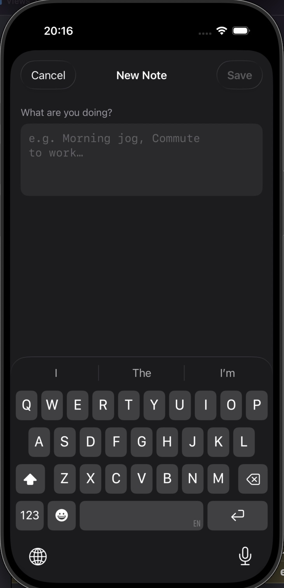
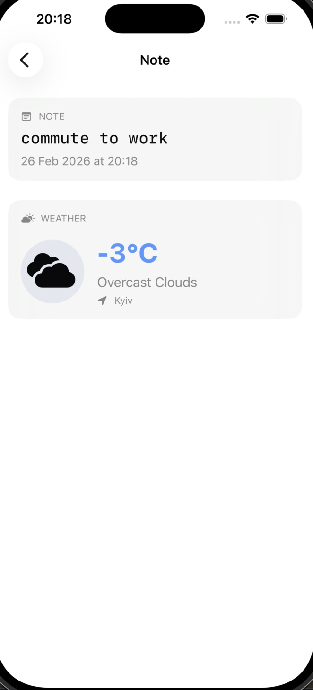
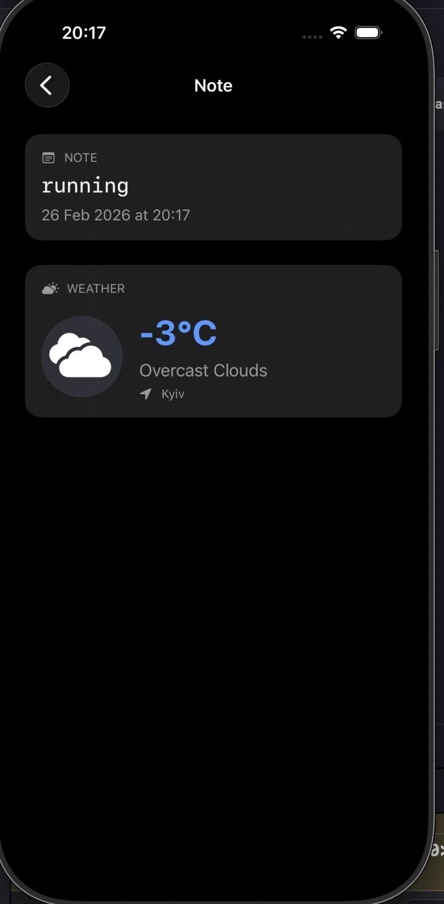
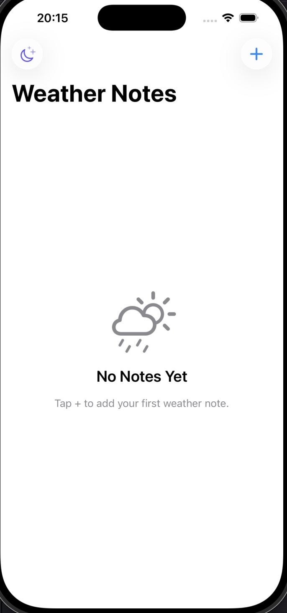
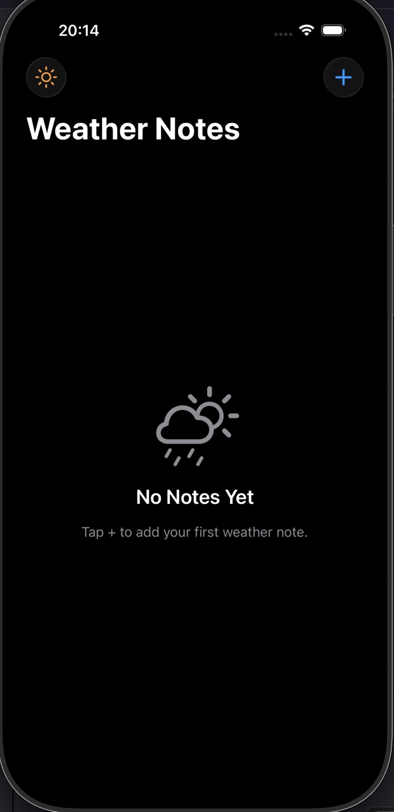

# WeatherNotes

A clean iOS app that pairs your daily notes with real-time weather. Every note you add automatically captures the current weather conditions — so you always remember what the sky looked like on your morning jog or commute.

## Screenshots

| | Light | Dark |
|---|---|---|
| **Notes List** |  |  |
| **Add Note** |  |  |
| **Note Detail** |  |  |
| **Empty State** |  |  |

## Features

- Add notes with a single text field — weather is attached automatically on save
- Live weather fetch from OpenWeatherMap for Kyiv on every note
- Each row shows note text, creation time, temperature (color-coded) and weather icon
- Detail screen with full forecast — condition, temperature, description, location
- Dark / light mode toggle in the toolbar, persisted across sessions
- Swipe to delete notes
- Typewriter (monospaced) font for note text
- Weather icons adapt: multicolor in dark mode, monochrome in light mode
- Empty state when no notes exist

## Tech Stack

- **UI** — SwiftUI
- **Architecture** — MVVM (`@MainActor`, `@Published`, `@StateObject`)
- **Networking** — `URLSession` + `async/await`, protocol-based `WeatherService`
- **Storage** — `UserDefaults` with `Codable` JSON encoding
- **Error handling** — typed `AppError` enum, user-facing alerts
- **Minimum iOS** — iOS 17

## Project Structure

```
WeatherNotes/
├── Models/
│   ├── WeatherNote.swift         # Core note model (Identifiable, Codable)
│   ├── WeatherData.swift         # Weather snapshot stored per note
│   └── WeatherResponse.swift     # OpenWeatherMap API response mapping
├── ViewModels/
│   ├── NoteListViewModel.swift
│   ├── AddNoteViewModel.swift
│   └── NoteDetailViewModel.swift
├── Views/
│   ├── NoteListView.swift
│   ├── AddNoteView.swift
│   └── NoteDetailView.swift
├── Components/
│   ├── NoteRowView.swift
│   └── WeatherIconView.swift
├── Services/
│   ├── WeatherService.swift      # URLSession network layer
│   └── NoteStorageService.swift  # UserDefaults persistence
├── Extensions/
│   ├── Font+Typewriter.swift
│   └── WeatherData+UI.swift      # Color helpers for temperature & conditions
└── Helpers/
    ├── AppError.swift
    └── Config.swift              # ⚠️ Not in git — see Setup below
```

## Setup

1. Clone the repo
   ```bash
   git clone https://github.com/kurog1ri/WeatherNotes.git
   ```

2. Create your config file from the template
   ```bash
   cp Config.template WeatherNotes/Helpers/Config.swift
   ```

3. Open `Config.swift` and replace `YOUR_API_KEY_HERE` with your key
   ```swift
   static let weatherAPIKey = "your_key_here"
   ```
   Get a free API key at [openweathermap.org/api](https://openweathermap.org/api)
   > New keys take up to 2 hours to activate.

4. Open `WeatherNotes.xcodeproj` in Xcode, select a simulator and run (`Cmd+R`)

## API

Weather data is fetched from [OpenWeatherMap](https://openweathermap.org/api) — free tier, no credit card required.

- Endpoint: `GET /data/2.5/weather?q=Kyiv&units=metric`
- Icons: SF Symbols mapped from OWM condition codes
